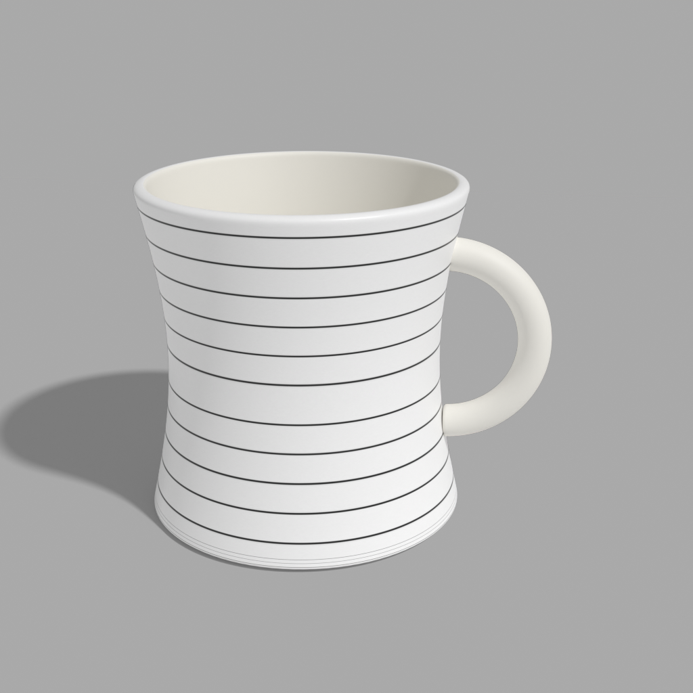
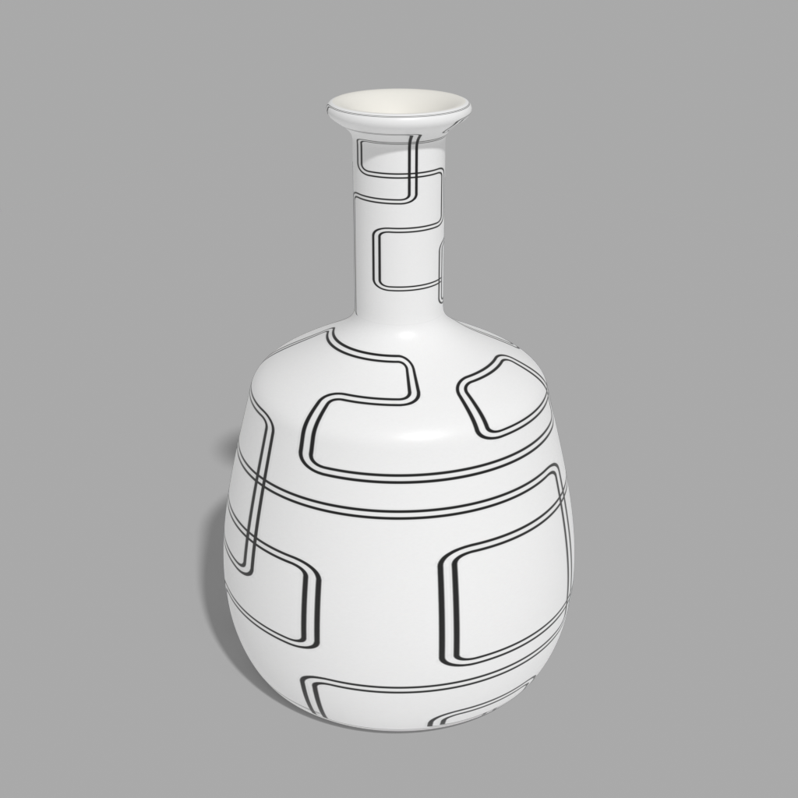
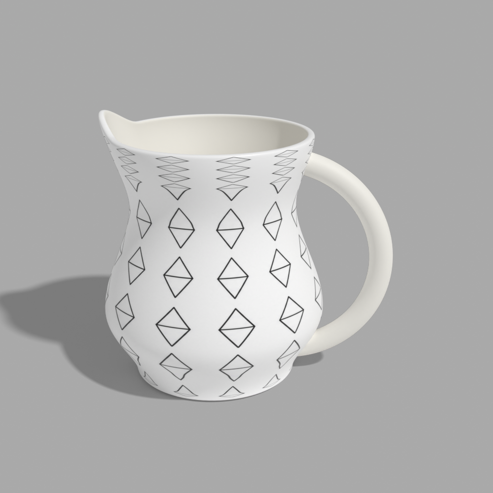

# Ceramix

A Blender-based procedural generation pipeline for creating synthetic datasets of textured ceramic vessels. The project automatically generates unique 3D ceramic vessels, applies surface design patterns, and renders high-quality images suitable for computer vision and machine learning research.

<p align="center">
  
  
  
</p>

---

# Motivation

Understanding how modern vision models perceive visual similarity requires datasets where different visual factors can be controlled independently. Real-world image datasets often contain uncontrolled variations such as lighting, backgrounds, viewpoints, and object placement, making it difficult to isolate the effect of object shape and surface appearance.

This project was created to address that problem by providing a fully procedural dataset of ceramic vessels. Every image is generated under controlled conditions, allowing researchers to study how image representations respond to changes in vessel geometry and decorative surface patterns.

The repository contains the complete generation pipeline, making the dataset fully reproducible and extensible.

---

# Repository Structure

```
.
├── main.py

├── pipeline_bottle.py
├── pipeline_bowl.py
├── pipeline_cup.py
├── pipeline_mug.py
├── pipeline_pitcher.py

├── generate_bottle_models.py
├── generate_bowl_models.py
├── generate_cup_models.py
├── generate_mug_models.py
├── generate_pitcher_models.py

├── apply_skin_to_bottle_models.py
├── apply_skin_to_bowl_models.py
├── apply_skin_to_cup_models.py
├── apply_skin_to_mug_models.py
├── apply_skin_to_pitcher_models.py

├── render_textured_bottles_to_png.py
├── render_textured_bowls_to_png.py
├── render_textured_cups_to_png.py
├── render_textured_mugs_to_png.py
├── render_textured_pitchers_to_png.py

└── input
    └── design
        ├── circle
        ├── scribble
        ├── square
        ├── stripped
        └── triangle
```

### Folder Description

| Component | Purpose |
|----------|---------|
| `generate_*` | Generates procedural 3D ceramic models |
| `apply_skin_*` | Applies design images as textures using UV mapping |
| `render_*` | Renders textured models into PNG images |
| `pipeline_*` | Runs the complete pipeline for one vessel type |
| `main.py` | Runs the pipeline for all vessel types |
| `input/design/` | Input design images grouped by category |

---

# Generation Pipeline

The dataset is generated in three stages.

```
Design Image
      │
      ▼
Generate Procedural 3D Models
      │
      ▼
Apply Surface Design
      │
      ▼
Render Images
      │
      ▼
Synthetic Dataset
```

### Step 1 — Generate Models

Procedural Blender scripts create multiple unique ceramic vessels with randomized dimensions and shapes.

Output:

```
output/<vessel>/model/
```

---

### Step 2 — Apply Surface Designs

Each generated model receives one of the input design patterns using automatic UV mapping.

Output:

```
output/<vessel>/design/
```

---

### Step 3 — Render Images

The textured models are rendered using Blender Cycles with consistent lighting, camera placement, and rendering settings.

Output:

```
output/<vessel>/render/
```

---

# Generating the Dataset

## Requirements

- Python 3
- Blender 4.x

Ensure the `blender` executable is available from the command line, or provide its location using `--blender-path`.

---

## Running the Entire Pipeline

Run

```bash
python main.py
```

This executes the complete pipeline for all supported vessel types:

- Bottle
- Bowl
- Cup
- Mug
- Pitcher

For each vessel type, the pipeline:

1. Generates procedural 3D models (if they do not already exist)
2. Applies every input design image as a surface texture
3. Renders the textured models into PNG images

---

## Command-Line Arguments

`main.py` forwards all command-line arguments to every pipeline script, so the same options can be used with either `main.py` or any individual `pipeline_<vessel>.py` script.

### `--instances`

Specifies the number of procedural models to generate for each vessel type.

Default:

```text
20
```

Example

```bash
python main.py --instances 100
```

---

### `--design-category`

Processes only a single design category instead of every design available.

Available categories:

- circle
- scribble
- square
- stripped
- triangle

Example

```bash
python main.py --design-category scribble
```

or

```bash
python main.py --instances 100 --design-category triangle
```

---

### `--blender-path`

Specifies the Blender executable if it is not available in your system PATH.

Example

```bash
python main.py \
    --blender-path "/path/to/blender"
```

---

## Running a Single Vessel Pipeline

Each vessel type can also be generated independently.

```bash
python pipeline_bottle.py
python pipeline_bowl.py
python pipeline_cup.py
python pipeline_mug.py
python pipeline_pitcher.py
```

These scripts support the same command-line arguments as `main.py`.

Examples

Generate 50 mugs

```bash
python pipeline_mug.py --instances 50
```

Generate only bowls using the triangle designs

```bash
python pipeline_bowl.py \
    --instances 100 \
    --design-category triangle
```

Use a custom Blender installation

```bash
python pipeline_pitcher.py \
    --blender-path "/path/to/blender"
```

---

## Output Structure

Generated files are organized as

```text
output/
└── <vessel>/
    ├── model/
    ├── design/
    │   └── <design-category>/
    │       └── <design-name>/
    └── render/
        └── <design-category>/
            └── <design-name>/
```

where

- `model/` contains the generated Blender models (`.blend`)
- `design/` contains textured Blender models
- `render/` contains the final rendered PNG images

---

## Incremental Generation

The pipeline automatically skips outputs that already exist.

This applies to:

- generated 3D models
- textured Blender files
- rendered PNG images

As a result, interrupted runs can be resumed without regenerating completed outputs.

---

# Dataset

The complete generated dataset is available on Zenodo.

**Zenodo:** **<INSERT ZENODO LINK HERE>**

The repository contains the full generation pipeline, allowing anyone to reproduce the dataset or generate additional vessel instances and design combinations.